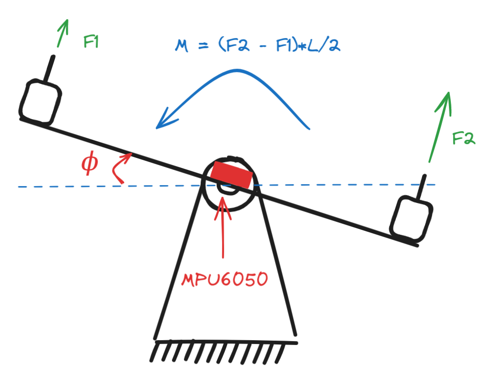
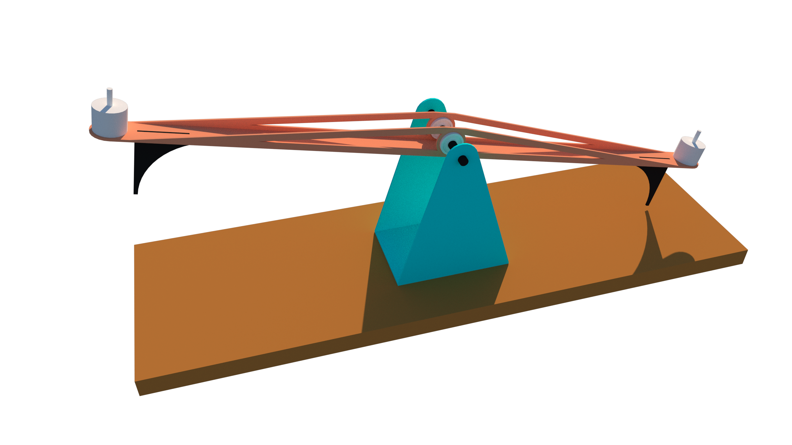

# Stabilization of a rotating arm

## ⚠️ Under Construction
This is a work in progress. Some of the code may not work as expected. Content may be incomplete or subject to change.

## Introduction

This project is about stabilizing a rotating arm. The arm is mounted on a pivot and is free to rotate in the vertical plane.

The goal is to stabilize the arm in the horizontal position (angle = 0). The arm is equipped with two motors and their propellers that can apply a torque to the arm. The motor is controlled by a microcontroller. The microcontroller reads the angle of the arm and applies a torque to the arm to stabilize it.

## 3D model

## Hardware

The hardware consists of the following components:

- Motors (brushless motors)
- Microcontroller (Arduino ATmega2560)
- IMU sensor (MPU6050 or MPU9250)
- Motor driver (ESC 30A)
- Power supply (12V)

## Software

There are 3 main software components:

- `arduino`: The code that runs on the microcontroller
- `web`: a server and dashboard that displays data from the microcontroller.

### Arduino

The arduino code reads the angle of the arm from the IMU sensor and applies a torque to the arm to stabilize it. The code also reads the setpoint angle from the server and adjusts the torque to reach the setpoint.

#### Components

- `MPUSensor`: A class that encapsulates the MPU sensor readings, configuration, and filtering.
- `MotorsController`: A class that encapsulates the motor control logic and the PID controller.

### Dashboard

The dashboard is a web application that displays data from the microcontroller in real-time. The dashboard is built using Chart.js.

### Server

The server communicates with the microcontroller and emits data to the dashboard. The server is built using Node.js and Socket.io.

## Authors

- [Ahmed Amine Nouabi](https://github.com/amineNouabi)
- [Soufiane Finiix]
